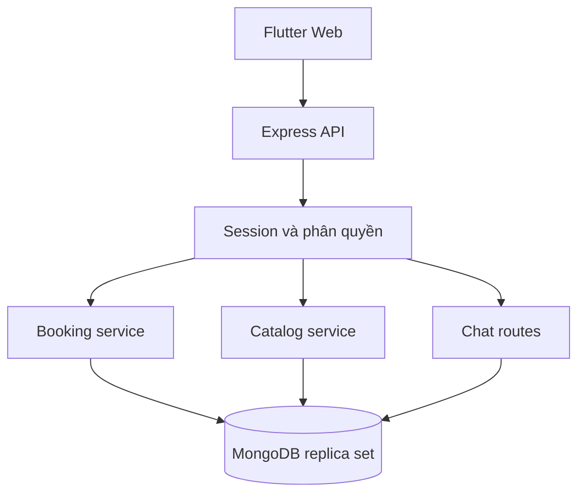

# Backend và thiết kế dữ liệu CineGo

## Luồng xử lý

Flutter Web trong trình duyệt gọi API Express cùng origin. Middleware kiểm tra session, quyền, CSRF và kiểu dữ liệu. Service thực hiện nghiệp vụ trong transaction MongoDB. Database không được truy cập từ trình duyệt. Đơn vị tiền là **số nguyên VND**, tránh sai số cộng tiền dấu phẩy động.

## Đối chiếu class cũ

Tên code dùng tiếng Anh theo thông lệ JavaScript; bảng này ánh xạ với tên lớp tiếng Việt trong bộ CD01–CD06. Không đổi ý nghĩa quan hệ chỉ để chuyển sang MongoDB.

| Class trong sơ đồ | Model/collection | Quan hệ chính |
| --- | --- | --- |
| Khách hàng | User / users | 1 khách có nhiều Order, Ticket và Membership; role phân biệt admin/customer |
| Rạp chiếu phim | Cinema / cinemas | 1 rạp có nhiều Room |
| Phòng chiếu | Room / rooms | Mỗi phòng thuộc 1 Cinema, có nhiều Seat và Showtime |
| Ghế | Seat / seats | Mô tả vật lý: hàng, số, loại, trạng thái sử dụng |
| Phim | Movie / movies | 1 phim có nhiều Showtime |
| Suất chiếu | Showtime / showtimes | Tham chiếu Movie, Room, Cinema; snapshot giờ kết thúc từ thời lượng phim |
| Ghế theo suất chiếu | ShowtimeSeat / showtimeseats | Unique `(showtimeId, seatId)`; giá và trạng thái riêng từng suất |
| Đơn đặt vé | Order / orders | Thuộc User, chứa loại booking/exchange và snapshot chính sách |
| Chi tiết đơn đặt vé | OrderItem / orderitems | Mỗi dòng đúng 1 ghế theo suất; giữ nguyên ghế/giá mua ban đầu |
| Vé điện tử | Ticket / tickets | Unique OrderItem, QR ngẫu nhiên, trỏ ghế hiện tại sau đổi |
| Giao dịch thanh toán | Payment / payments | Nhiều lần thử trên 1 Order; mỗi lần thu thành công có reference duy nhất |
| Hoàn tiền | Refund / refunds | Tham chiếu Payment gốc, Ticket, ChangeRequest |
| Yêu cầu hủy / yêu cầu đổi | ChangeRequest / changerequests | Dùng discriminator logic `type=cancel/exchange`, mỗi yêu cầu cho 1 Ticket |
| Chính sách vé | config + snapshot trong Order, Ticket, ChangeRequest | Phiên bản `proposal-1`; không tự đổi chính sách của vé đã bán |
| Phòng chat | ChatRoom / chatrooms | Unique showtimeId |
| Thành viên phòng chat | Membership / memberships | Unique `(userId, chatRoomId)` |
| Tin nhắn | Message / messages | Thuộc phòng và người gửi; lưu tên hiển thị ở thời điểm gửi |
| Vị trí hiện tại / kết quả rạp gần | State của trang Cinemas | Không lưu database, tính khoảng cách Haversine trên thiết bị |
| Dịch vụ đặt vé / thanh toán / hủy đổi | booking.js | Các hàm hold, payDemo, cancelTicket, exchange, releaseExpired |
| Dịch vụ suất chiếu | catalog.js | saveShowtime, deleteShowtime, saveRoom, editSeat |
| Dịch vụ phòng chat | routes/customer.js | join, messages, leave và kiểm tra vé hiện tại |

Model bổ sung phục vụ triển khai: **Session** (hash token, CSRF, hết hạn); **Allocation** (phân bổ số tiền thu vào từng vé và số đã hoàn); **Audit** (sự kiện nghiệp vụ). MongoDB dùng ObjectId thay cho UUID của sơ đồ phân tích; đây là khác biệt kỹ thuật được ghi rõ.

## Các ràng buộc quan trọng

1. **Giữ ghế**: xác thực danh sách ID duy nhất, 1–8 ghế cùng suất; không tin giá client. Trong transaction, khóa bản ghi khách và suất bằng revision, cập nhật có điều kiện toàn bộ ghế. Chỉ thành công khi đủ số ghế. Tối đa 3 đơn chờ còn hạn trên mỗi khách, kiểm tra lại bên trong transaction.
2. **Hết hạn**: thời hạn là 10 phút theo cấu hình. Worker quét mỗi 15 giây, tối đa 100 đơn/lần; chạy lại khi restart. Điều kiện thanh toán kiểm tra thời hạn trực tiếp, không phụ thuộc worker hoặc TTL. Hold cũ hết hạn có thể được nhận lại mà worker chưa chạy; release cũ chỉ cập nhật ghế vẫn mang đúng orderId.
3. **Thanh toán mô phỏng**: chỉ khi `PAYMENT_MODE=demo`, bị cấm ở production. Người dùng chỉ thao tác đơn của mình. Payment thành công, vé, ghế và chi tiêu thành viên nằm trong cùng transaction. Retry trả kết quả đã thanh toán; unique reference chống thu lặp. Không coi redirect hay dữ liệu client là bằng chứng thanh toán thật.
4. **Đổi vé**: tạo Order loại exchange giữ ghế mới; vé cũ còn nguyên. Sau xác nhận, kiểm tra lại quyền, hạn đổi, trạng thái và ghế cũ; thu chênh hoặc hoàn theo Allocation; chuyển ghế, đổi QR, giải phóng ghế cũ trong cùng transaction. Chỉ đổi 1 vé/lần, cùng phim; có thể khác rạp. Không thay OrderItem gốc.
5. **Hủy vé**: kiểm tra từng Ticket, từ chối vé used/cancelled/hết hạn đổi hoặc đang có yêu cầu đổi. Hủy, trả ghế, tạo Refund và trừ chi tiêu trong transaction. Lặp yêu cầu trên vé đã hủy không tạo hoàn tiền thứ hai.
6. **Hoàn tiền**: trừ dần các Allocation từ giao dịch mới nhất; tổng hoàn không vượt tiền đã thu. Trạng thái pending/failed có trong schema cho mở rộng, nhưng adapter hoàn tiền thật và worker retry **chưa triển khai**. Ở demo, hoàn tiền chỉ là ghi nhận giả lập thành công.
7. **Suất chiếu**: khóa Room để tuần tự hóa tạo/sửa lịch cùng phòng; tính giờ kết thúc từ duration, thêm 15 phút dọn phòng khi kiểm tra trùng. Không sửa/xóa suất đã có vé/đơn thanh toán hoặc hold còn hạn. Giá theo loại ghế được sao chép vào ShowtimeSeat.
8. **Chat**: phải chủ động tham gia; từng lần đọc/gửi cần vé valid của đúng suất, membership và suất chưa kết thúc. Hủy/đổi vé cuối cùng của suất làm mất membership. Gửi tin khóa ticket/membership trong transaction để đồng bộ với hủy hoặc rời phòng. Chỉ văn bản, Flutter hiển thị bằng widget Text.
9. **Soát vé**: admin nhập QR, chỉ cho dùng một lần, từ 60 phút trước đến hết suất. Ghế của vé đã used vẫn booked. QR đổi khi đổi vé, QR cũ mất hiệu lực.
10. **Điểm**: `floor(max(0, netSpend) / POINTS_PER_VND)`. Chi tiêu tăng theo khoản thu và giảm theo hoàn. Điểm không phải tiền, chưa có đổi điểm hay mã giảm giá.

## API

Mọi API trả JSON; lỗi `{message: string}`. Mutating request từ trình duyệt cần Origin đúng `APP_ORIGIN`; khi đã đăng nhập cần `x-csrf-token` nhận từ đăng nhập hoặc `/auth/me`. Cookie session HttpOnly. Tất cả đường dẫn dưới `/api`.

| Phương thức | Đường dẫn | Quyền / công việc |
| --- | --- | --- |
| GET | /health, /config | Công khai; trạng thái server, chế độ và chính sách |
| GET | /movies?q=&status=, /movies/:id | Danh sách, tìm và xem phim |
| GET | /cinemas | Rạp hoạt động |
| GET | /showtimes?movieId=&cinemaId=&date= | Lịch chiếu tương lai; date theo UTC+7 |
| GET | /showtimes/:id/seats | Sơ đồ ghế; không lộ chủ đơn hoặc QR |
| POST | /auth/register, /auth/login | Đăng ký/đăng nhập có rate limit |
| GET | /auth/me | Hồ sơ và CSRF của phiên |
| POST | /auth/logout, /auth/password | Thu hồi phiên; đổi mật khẩu thu hồi tất cả phiên |
| PATCH | /auth/profile | Sửa tên và điện thoại |
| GET / POST | /orders | Đơn của mình / tạo hold với idempotencyKey UUID |
| GET | /orders/:id | Đơn, ghế, phim, rạp và lịch sử thanh toán của mình |
| POST | /orders/:id/pay-demo | `{outcome: "success" hoặc "failed"}`; chỉ demo |
| POST | /orders/:id/cancel | Hủy đơn chưa thanh toán |
| GET | /tickets | Vé, suất, ghế hiện tại, thông tin hoàn của mình |
| POST | /tickets/:id/cancel | Hủy một vé và hoàn mô phỏng |
| POST | /tickets/:id/exchange | `{seatId, idempotencyKey}` → Order đổi vé |
| POST | /chat/:showtimeId/join | Đồng ý tham gia phòng |
| DELETE | /chat/:showtimeId/membership | Rời phòng |
| GET / POST | /chat/:showtimeId/messages | 100 tin gần nhất / `{body}` tối đa 1000 ký tự |
| GET | /admin/overview | Thống kê đơn giản |
| GET | /admin/data/:entity?page= | Phân trang 50 bản ghi; entities giới hạn danh sách trắng |
| POST / PUT / DELETE | /admin/movies, /admin/cinemas | Tạo; PUT/DELETE thêm /:id; DELETE ẩn để giữ lịch sử |
| POST / PUT / DELETE | /admin/rooms | Tạo sơ đồ; sửa/xóa khi chưa có lịch |
| PATCH | /admin/seats/:id | Loại ghế và active; chặn sửa phòng có lịch tương lai |
| POST / PUT / DELETE | /admin/showtimes | Lịch/giá, kiểm tra xung đột và đơn |
| PATCH | /admin/users/:id | `{active: boolean}`; chỉ khách, không tự khóa admin |
| POST | /admin/check-in | `{qr}`; dùng vé một lần |

`orders` và `tickets` khách hàng giới hạn 100 bản ghi gần nhất; chat 100 tin gần nhất; phim 100; lịch 500. Cần thêm pagination nếu vận hành với dữ liệu lớn. Trang admin đã có pagination.

## Tham khảo

- Bố cục chọn phim/rạp/lịch lấy cảm hứng từ Galaxy Cinema: https://www.galaxycine.vn/ và https://www.galaxycine.vn/lich-chieu/ . Không sao chép thương hiệu hoặc tài sản hình ảnh.
- MongoDB transactions: https://www.mongodb.com/docs/manual/core/transactions/
- Express security: https://expressjs.com/en/advanced/best-practice-security/

## Frontend Flutter

Flutter Web sử dụng BrowserClient với credentials, cookie HttpOnly không đọc bằng Dart, CSRF chỉ giữ trong bộ nhớ Session. Bản release và API cùng origin; hot reload dùng CORS chính xác theo APP_ORIGIN. Express phục vụ frontend/build/web. CanvasKit, Roboto và Material Icons được đóng gói cục bộ; build với --csp --no-web-resources-cdn. CSP cho phép wasm-unsafe-eval để CanvasKit thực thi WebAssembly, không mở JavaScript unsafe-eval. Các trang dùng widget Text cho dữ liệu người dùng.
